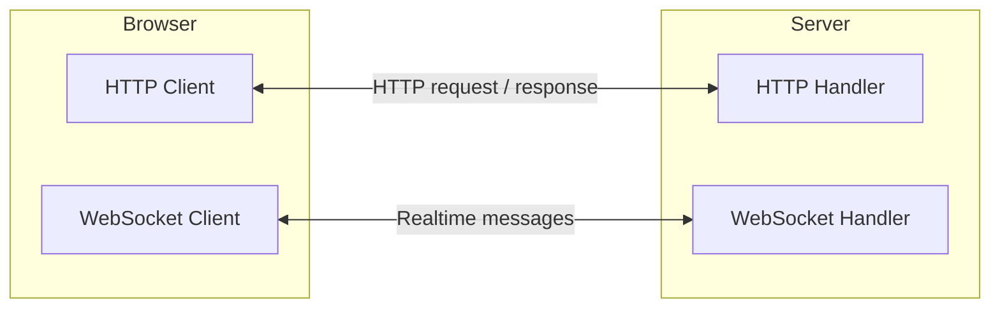
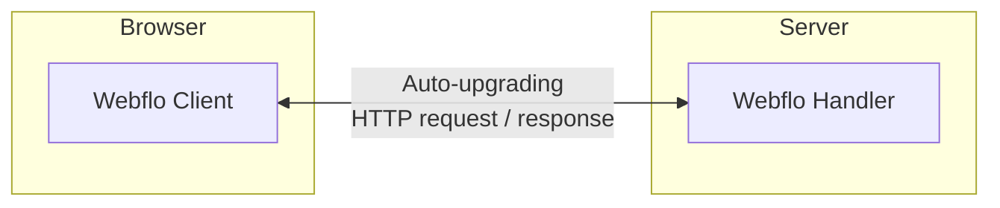
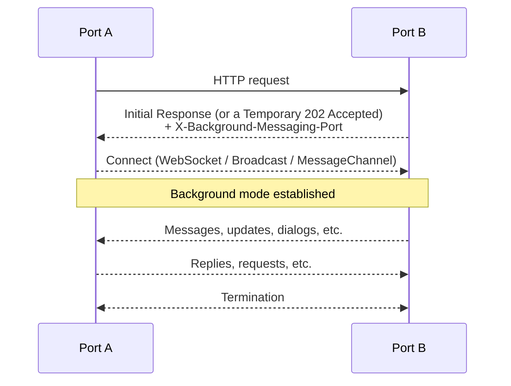

# Webflo Realtime

Realtime experiences — collaborative documents, live dashboards, chat windows, streaming progress bars — are what make modern web apps feel _alive_.
They’re also the difference between form submissions that make you wait and form submissions that feel like a live conversation.

Webflo apps work this way by default.

They're powered by a rich set of APIs designed for every use case:

```js
return new LiveResponse(data, { done: false });
```

```js
event.respondWith({ progress: 10 }, { done: false });
```

```js
event.waitUntilNavigate();
```

```js
event.client.addEventListener('message', handle);
event.client.postMessage({ message: 'You seem to be typing something.' });
```

```js
const result = await event.user.confirm({ message: 'Should we proceed?' });
const result = await event.user.prompt({ message: 'What is your name?' });
```

```js
const { channel, leave } = event.client.enterChannel('test-channel');
```

## The Traditional Setup

Historically, building realtime applications required a significant amount of setup.
It extended beyond the simple request–response model and into a world of parallel WebSocket connections and streaming protocols.
It presented two protocols, two lifecycles, and an awkward choreography between them — keeping them in sync, closing them both cleanly, and rebuilding them on every reconnect.



This works — but it’s hardly effortless.
That’s requests on one channel, updates on another.

## The Webflo Model

In Webflo, this behavior is built in.
The same request that starts over HTTP can seamlessly continue as a live, bidirectional exchange — with no moving parts or extra line of code at the application layer.

This is like the entire architecture above collapsed into one: an **auto-upgrading connection** that can be used for many different things.



This is the same HTTP request / response lifecycle, only **with "live" mode built-in**.

## How It Works

In Webflo, you simply write route handlers that can talk for as long as they need to — without worrying about the transport layer or the lifecycle of the connection.

```js
export async function GET(event, next) {
  if (next.stepname) return await next(); // The conventional delegation line

  event.respondWith({ step: 1 }, { done: false });
  await new Promise((r) => setTimeout(r, 500));
  event.respondWith({ step: 2 });
}
```

Here, the browser first renders `{ step: 1 }`, then `{ step: 2 }` half a second later — all within the same request.

When a handler continues sending responses or messages, Webflo transparently upgrades the underlying connection and handles the lifecycle behind the scenes.

### What Happens

1. The first response is sent normally over HTTP.
2. Webflo detects that the handler hasn’t returned yet.
3. It silently upgrades the connection, tagging the initial response with a header that tells the client to connect in the background.
4. The client renders the first data and immediately joins the background channel.
5. A two-way line now exists — and either side can send or receive messages.
6. The handler pushes its next response, this time, it's delivered via the upgraded connection.
7. The client renders it instantly — replacing the previous rendered state.
8. Webflo closes automatically when the handler finishes or the user navigates away.

::: info Further Details

- Full handshake details are covered in **[Appendix A – The Realtime Lifecycle](#appendix-a-–-the-realtime-lifecycle)**.
  :::

## The Two Ends of the Line

A realtime conversation always has two sides — _Port A_ and _Port B_.

### _Port A_: Upstream Route Handlers

Realtime conversations are initiated by route handlers — as part of responses to HTTP requests.
These route handlers function as _Port A_.

The **primary** realtime API here is `event.client` — a Webflo `MessagePort` supporting things like: `.postMessage()`, `.addEventListener()`, etc.

```js
export default async function (event) {
  event.client.postMessage({ hello: 'world' });
}
```

`event.client` is the API that other APIs like `event.respondWith()`, `event.user.prompt()`, etc. use under the hood.

### _Port B_: Downstream Clients

Realtime conversations are received downstream as part of responses to an initial HTTP request.
These HTTP clients or handlers are the _Port B_.

The primary realtime API here is `liveResponse.background` — the same Webflo `MessagePort` interface as `event.client`, supporting things like: `.postMessage()`, `.addEventListener()`, etc.

```js
const response = await fetch('https://api.example.com/data');
const liveResponse = LiveResponse.from(response);

liveResponse.background.addEventListener('message', (message) => {
  console.log(message);
});
```

Typical Port B clients in Webflo are:

- The App UI
- Intermediate Route Handlers

::: info LiveResponse
`LiveResponse` is the "live" version of the standard `Response` API.
It extends the native `Response` object with a live body, headers, and status — all of which can be mutated in-place.
:::

#### The App UI

Every Webflo SPA has a client-side Webflo instance — `window.webqit.app`. It mounts via the _client_ script that Webflo injects into the page at build time.

```html
<script src="/app.js"></script>
```

This client manages in-app navigations, turning them into seamless request–response flows — becoming a typical _Port B_ in the realtime system. In each of those flows, the client occupies the top-most end of the line. It receives everything that handlers send as part of a response, applies live updates to the document, and manages any interactive exchanges.

The applicable realtime API here is `window.webqit.app.background` (`app.background`, for short) — an extension of Webflo `MessagePort` supporting things like: `.postMessage()`, `.addEventListener()`, etc.

The `app.background` port is also a _multi-port_ hub housing all _active_ background activities across page navigations.
Every interaction on this API is thus an interaction over all active realtime conversations.

```js
app.background.addEventListener('message', (message) => {
  console.log(message);
});
```

::: info App-Level Background Activities
It is possible to listen to all background activities in the app via `app.background`. We'll use this API to drive a custom dialog UI just ahead.
:::

#### Intermediate Route Handlers

With Webflo's realtime capabilities being an **upgrade** to the existing HTTP request/response model,
realtime connections can be intercepted at _any point_ along that flow just as routing in Webflo can happen at various layers along that flow. A client-side handler or service-worker-side handler, for example, can intercept the conversation at their level.

The background connection comes along with the upstream response obtained via `next()` or `fetch()`.

```js
export default async function (event, next) {
  if (next.stepname) return await next(); // The conventional delegation line

  const response = await next();
  const liveResponse = LiveResponse.from(response);
  liveResponse.background.addEventListener('message', (message) => {
    console.log(message);
  });

  return liveResponse;
}
```

This intermediate handler essentially talks to the upstream via `liveResponse.background` (the _Port B_) while letting the same response flow downstream.

The handler’s own `event.client` port remains its own _Port A_ for communicating with the downstream.

---

::: tip
While not explicitly mentioned, external Webflo servers are just as accessible and interactive as the local server. A server-to-server interaction, for example, is just a matter of `LiveResponse.from(await fetch('https://api.example.com/data'))`.
:::

## Entering Background Mode

A handler **enters background mode** when it responds to a request interactively as any of the below scenarios.
Webflo automatically upgrades the connection to a realtime connection — initiating the _handshake sequence_ with the client and keeping the communication open until _termination_ is triggered — as in [the Realtime Lifecycle](#appendix-a-–-the-realtime-lifecycle).

### _Handler sends a message at any point in its lifecycle_

A handler may send a message at any point in its lifecycle by either:

1. calling `event.client.postMessage()`:

```js
event.client.postMessage({ progress: 10 });
```

2. or achieving the same through higher-level APIs like `event.user.confirm()`:

```js
const result = await event.user.confirm({ message: 'Are you sure?' });
```

### _Handler returns a response and explicitly marks it **not done**_

A handler may return a response and explicitly mark it **not done** by calling `event.respondWith()` (or returning `LiveResponse`) with `{ done: false }`:

```js
event.respondWith(data, { done: false });
```

```js
return new LiveResponse(data, { done: false });
```

### _Handler holds down the event lifecycle via promises_

A handler may hold down the event lifecycle via promises by either:

1. explicitly calling `event.waitUntil()` or `event.waitUntilNavigate()` before returning a response:

```js
event.waitUntilNavigate();
event.respondWith(data);
```

```js
event.waitUntil(new Promise(() => {}));
return data;
```

2. or calling `event.respondWith()` (or returning `LiveResponse`) with a promise that resolves to a response:

```js
event.respondWith(
  new Promise((resolve) => {
    setTimeout(() => {
      resolve(data);
    }, 1000);
  })
);
```

3. or calling `event.respondWith()` (or returning `LiveResponse`) with an async callback as second argument:

```js
event.respondWith(data, async ($data /* reactive copy of data */) => {
  await new Promise((resolve) => setTimeout(resolve, 1000));
  $data.someProp = 'someValue';
  await new Promise((resolve) => setTimeout(resolve, 1000));
  $data.someProp = 'someOtherValue';
});
```

### _Handler returns a `Generator` object_

A handler may return a `Generator` object by either:

1. being itself a [`generator function declaration`](https://developer.mozilla.org/en-US/docs/Web/JavaScript/Reference/Statements/function*):

```js
export default async function* (event) {
  yield data1;
  yield new Response(data2);
  yield new LiveResponse(null, { headers: { Location: '/' } });
}
```

2. or returning a [`Generator` interface](https://developer.mozilla.org/en-US/docs/Web/JavaScript/Reference/Global_Objects/Generator) as value:

```js
export default async function (event) {
  return {
    next: async () => ({ done: true }),
    return: async () => undefined,
    throw: async () => undefined,
  };
}
```

### _Handler returns a `State` object_

A handler may return a `State` object by declaring a `live` function:

```js
export default async live function(event) {
    const data = { progress: 0 };

    setInterval(() => {
        data.progress += 10;
    }, 1000);

    return data;
}
```

The `live` keyword is a shorthand for defining a quantum function that returns a `State` object.

---

Webflo knows to switch the connection to background mode in all the above cases.

::: tip In Practice

- Entering or not entering background mode is often not something you need to be conscious of.
- A handler just happens to be interactive or not interactive depending on request types and how they lend themselves to be handled.
- **Webflo simply fulfills the intent of however a handler works**.
  :::

## Real-World Examples

Below are some examples of how Webflo's realtime features work in action.

### Live Responses

#### Example — Replace state

This handler returns a `LiveResponse` whose body starts as `{ step: 1 }` and is replaced with `{ step: 2 }` after ~200ms; the UI updates automatically.

**_Result_:** The page first renders step: 1, then updates to step: 2 after ~200ms.

```js
import { LiveResponse } from '@webqit/webflo';
```

```js
export async function GET(event, next) {
  if (next.stepname) return await next(); // The conventional delegation line

  const res = LiveResponse.from({ step: 1 }, { done: false });
  setTimeout(() => res.replaceWith({ step: 2 }), 200); // [!code highlight]

  return res;
}
```

#### Example — Mutate state in place

This handler returns a skeleton object immediately for fast page load and then builds the object tree progressively as data arrives; the UI reflects every step of the object's construction.

**_Result_:** The UI renders a skeleton first, then progressively fills in as the object tree is built from the server.

```js
import Observer from '@webqit/observer';
```

```js
export async function GET(event, next) {
  if (next.stepname) return await next(); // The conventional delegation line

  const data = {
    menu: [
      { name: 'Home', href: '/' },
      { name: 'About', href: '/about' },
      { name: 'Contact', href: '/contact' },
    ],
    content: {
      header: 'Loading...',
      body: [],
    },
  };

  event.waitUntil(
    new Promise(async (resolve) => {
      const someData = await fetch('https://api.example.com/data');
      Observer.set(data.content, 'header', someData.header);

      Observer.proxy(data.content.body).push(
        { text: 'Inventory 1:' + someData.items[0] },
        { text: 'Inventory 2:' + someData.items[1] }
      );

      const someData2 = await fetch('https://api.example.com/data2');
      Observer.proxy(data.content.body).push(
        { text: 'Inventory 3:' + someData2.items[0] },
        { text: 'Inventory 4:' + someData2.items[1] }
      );

      resolve();
    })
  );

  return data;
}
```

#### Example — Live database results (LinkedQL)

This handler responds with a live posts list from the database using [LinkedQL](https://github.com/linked-db/linked-ql); as upstream data changes, `rows` update continuously.

**_Result_:** On the UI, the list grows live as new posts are added upstream.

```js
export async function GET(event, next) {
  if (next.stepname) return await next(); // The conventional delegation line

  const result = await client.query(
    `SELECT * FROM posts WHERE date_created > '2023-01-01'`,
    { live: true, signal: event.signal }
  );

  event.waitUntilNavigate(); // Hold down the event lifecycle

  return { posts: result.rows }; // [!code highlight]
}
```

#### Example — Redirect after work

This handler emits progress and then issues a redirect when the work completes.

**_Result_:** The page shows intermediate progress, then redirects to `/done` when work completes.

```js
export async function POST(event, next) {
  if (next.stepname) return await next(); // The conventional delegation line

  // Initiate response
  event.respondWith({ step: 1 }, { done: false });
  // Make API call
  await fetch('https://api.example.com/data');
  // Update response
  event.respondWith({ step: 2 }, { done: false });

  // Redirect
  event.respondWith(null, { status: 302, headers: { Location: '/done' } }); // [!code highlight]
}
```

### User Dialogs: Server ↔ User Interaction

#### Example — Ask for confirmation

This handler pauses request processing to interact with the user before proceeding, using realtime messaging.

**_Result_:** The user is prompted to confirm an action; on OK, the handler proceeds.

```js
export async function DELETE(event, next) {
  if (next.stepname) return await next(); // The conventional delegation line

  const message = 'This item will be permanently deleted. Are you sure?';
  const answer = await event.user.confirm({ message }); // [!code highlight]
  if (answer?.data === true) {
    // proceed
  }

  return Response.json({ ok: true });
}
```

The Webflo UI client shows the dialog (native `confirm()/prompt()` or custom UI if configured) and returns the user's response.

Customization is as simple as intercepting these via `preventDefault()` to render your own modals.

```javascript
// Intercept at window.webqit.app.background
window.webqit.app.background.addEventListener('prompt', (e) => {
  e.preventDefault(); // [!code highlight]
  customDialog(e.data.message).then((result) => {
    // Reply to the request on the provided port
    e.ports[0].postMessage(result); // [!code highlight]
  });
});
```

### Message Channels

#### Example — Channel chat (server + client + UI)

These handlers establish a chat channel and broadcast messages to all participants.

**_Result_:** Messages appear in the chat trail every few seconds; incoming vs outgoing messages are styled differently.

```js
export async function GET(event, next) {
  if (next.stepname) return await next(); // The conventional delegation line

  // Channel ID - must tally with the client-side ID
  const channelID = 'test-channel';

  const { channel, leave } = event.client.enterChannel(channelID, {
    // Optionally annotate user's messages with user's name
    resolveData: (message) => ({ ...message, user: 'sample name' }),
  });

  event.waitUntilNavigate(); // keep open
  event.client.addEventListener('close', (e) => {
    //e.preventDefault();
    console.log('Chat closed');
  });
}
```

Then on the client:

```js
export default async function (event, next) {
  if (next.stepname) return await next(); // The conventional delegation line

  // Initialize states
  const data = { messageTrail: [{ message: 'Beginning of chat...' }] };
  await event.respondWith(data, { done: false }); // [!code highlight]

  // The messaging part
  const response = await next(); // Call server
  const chatPort = LiveResponse.from(response).background;

  // Channel ID - must tally with the server-side ID
  const channelID = 'test-channel';

  // Listen to upstream messages - from others in the same channel
  chatPort.addEventListener(`${channelID}:message`, (e) => {
    Observer.proxy(data.messageTrail).push(e.data); // [!code highlight]
  });

  // Send messages to the chat
  setInterval(() => {
    const message = { message: `Hello from ${navigator.userAgent}` };

    // Send to others in the same channel
    chatPort.postMessage(message, {
      wqEventOptions: { type: `${channelID}:message` },
    }); // [!code highlight]

    // Add to the local trail
    Observer.proxy(data.messageTrail).push(message); // [!code highlight]
  }, 6000);
}
```

::: details Then on the UI

```html
<div>
  Welcome to chat!
  <ul render="#items: (m) of data?.messageTrail / 'message'">
    <template def="message" scoped>
      <li
        class="chat-message"
        render="#text: m.event || m.message; ~type: m.user && 'incoming' || 'outgoing';"
      ></li>
    </template>
  </ul>
  <style scoped>
    ul:has(.chat-message) {
      list-style: none;
      padding: 0;
    }
    .chat-message {
      padding: 20px;
      margin: 10px;
    }
    .chat-message[type="incoming"] {
      margin-right: 200px;
      background-color: blue;
    }
    .chat-message[type="outgoing"] {
      margin-left: 200px;
      text-align: right;
      background-color: teal;
    }
  </style>
</div>
```

:::

::: warning
- Channel IDs must be unique and unguessable across the app.
- Channels are not persistent and are only active for the duration of the request. A database is required to store channel data.
:::

## Appendix A – The Realtime Lifecycle

The realtime lifecycle — from handshake to termination — can be summarized as follows. Note that this is the model between any two ports — Port A and Port B, not just between the client and the server, as that's only typical.



### The Handshake

On entering background mode, Webflo initiates a handshake sequence as follows:

1. Webflo gives the initial response a unique `X-Background-Messaging-Port` header that tells the client to connect in the background after rendering the initial response.
   > If the scenario is that the handler tiggers `event.client` messaging  _before_ yielding a response, Webflo sends a temporary `202 Accepted` response to the client carrying this header.
2. The client reads that header and opens the background channel.
   > If the client fails to connect within the handshake window, Webflo abandons the wait and concludes the request normally.
3. On connecting, both sides resume the same request context — now in live mode.

### Termination

Communication remains active until one of three events occurs and triggers a controlled closure:

1. The handler completes and no longer holds the event lifecycle.
2. The user navigates away, triggering a `navigate` event on the handler's `event.client` port.
   > If the handler calls `event.preventDefault()` on the `navigate` event, Webflo knows to not close the connection. **You must explicitly call `event.client.close()` when finished.**
3. Either side explicitly calls `.close()` on its own port to end the conversation.
